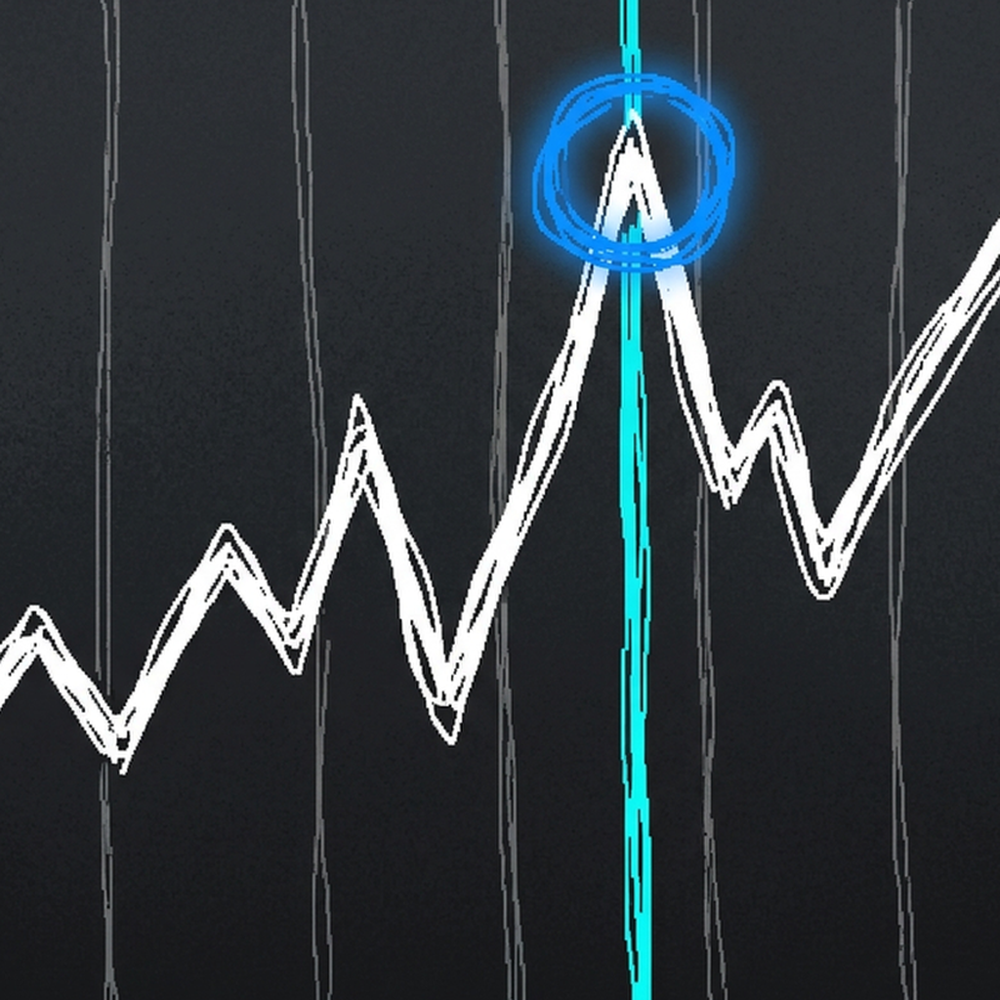
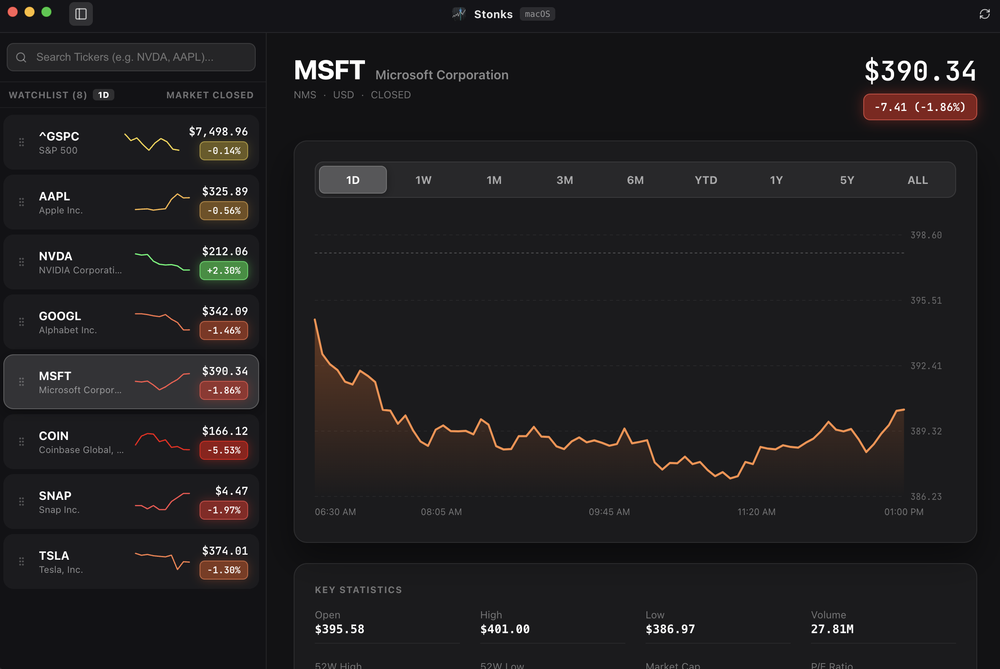

<p align="center">
  
</p>

<h1 align="center">Stonks</h1>

<p align="center">
  <strong>A native macOS-inspired stock tracking & financial analytics desktop application.</strong>
</p>

<p align="center">
  
  
  
  
</p>

---

## 📸 Overview

**Stonks** delivers a sleek, responsive, and native desktop stock monitoring experience built with Electron, React, TypeScript, and Vite. Designed specifically with macOS design principles in mind, it provides real-time market quotes, detailed interactive charts, customizable watchlist drag-and-drop ordering, and key stock metrics.

<p align="center">
  
</p>

---

## ✨ Features

- ** Native macOS Experience**: Built with a sleek dark-mode palette (`#0E0E10`), frameless inset title bar with traffic light window controls, and smooth background translucency.
- **📊 Interactive Stock Charts**: View market trends across flexible timeframes (`1D`, `1W`, `1M`, `3M`, `6M`, `YTD`, `1Y`, `5Y`, `ALL`, `CUSTOM`) complete with dynamic SVG line gradients, range axes, hover tooltips, price crosshairs, and custom start/end date range selection.
- **📅 Custom Date Ranges**: Select any custom start and end date (including single full trading days or multi-day periods) to calculate price changes and render custom charts.
- **🟢 Dynamic Color Indicators**: Visual feedback that dynamically adapts gradient overlays and badge highlights—emerald green (`#30D158`) for gains and ruby red (`#FF453A`) for market dips.
- **⚡ Live Market Quotes & Key Statistics**: Fetches realtime data via Yahoo Finance API including current price, daily change, high/low bounds, volume, 52-week ranges, market cap, and P/E ratios.
- **⚡ 30-Second TTL Caching & Auto-Refresh**: Instantaneous ticker switching with 30s in-memory response caching and automated 30s background polling for live quotes.
- **🗂 Watchlist Management & Context Menu**: Add, reorder (drag & drop), and right-click any ticker in the sidebar to open a native macOS context menu for easy removal or quick viewing. Default watchlist features the top 3 US indexes and top 5 US stock market tickers.
- **🏷 Multi-Mode Watchlist Badges**: Click any watchlist badge to toggle between displaying **Percentage Change** (`-1.86%`), **Price Change** (`-$7.41`), or **Market Capitalization** (`$3.08T`).
- **⌨ Keyboard Shortcuts**: Press `Cmd + K` (or `Ctrl + K`) to immediately open the ticker search modal anywhere in the app.

---

## 🛠 How It Works

Stonks combines a modern React web frontend with an Electron desktop wrapper for low latency, native system integration, and persistent local storage.

```
┌──────────────────────────────────────────────────────────┐
│                      Stonks App                          │
├────────────────────────────┬─────────────────────────────┤
│   Electron Main Process    │   React Frontend (Vite)     │
│  - Window Management       │  - Sidebar & Watchlist      │
│  - IPC Settings Handler    │  - Interactive Stock Chart  │
│  - Dock Icon & Native Menu │  - Market Statistics        │
└──────────────┬─────────────┴──────────────┬──────────────┘
               │                            │
               ▼                            ▼
      settings.json                 Yahoo Finance API
```

1. **Main Process (`electron/main.js`)**: Manages the lifecycle of the desktop application, initializes the `BrowserWindow` with native macOS `hiddenInset` titlebar styling, and registers IPC main handlers for settings persistence (`get-settings`, `save-settings`), window controls, and CORS-bypassing stock API fetching (`fetch-stock-api`).
2. **Preload Script (`electron/preload.js`)**: Safely exposes IPC communication methods to the frontend application using Electron's `contextBridge`, preserving `contextIsolation`.
3. **Frontend Application (`src/`)**:
   - **`App.tsx`**: State coordinator managing watchlist state, active symbol, selected timeframe, and background data synchronization.
   - **`Sidebar.tsx`**: Manages interactive ticker search, badge display mode toggles, and drag-and-drop item reordering.
   - **`StockChart.tsx`**: Renders custom SVG chart representations with responsive path scaling, dynamic color gradients, crosshair tracking, and time labels.
   - **`StockDetail.tsx`**: Displays detailed header information, timeframe selectors, interactive chart container, and key financial statistics cards.
   - **`yahooFinanceApi.ts`**: Handles network communication, response parsing, sparkline calculations, and query fallbacks.

---

## 🚀 Getting Started

### Prerequisites

Ensure you have **Node.js** (v18.0 or higher) and **npm** installed on your system.

### Installation

1. Clone the repository:
   ```bash
   git clone https://github.com/orangechuice/stonks-app.git
   cd stonks-app
   ```

2. Install dependencies:
   ```bash
   npm install
   ```

---

## 💻 Usage & Scripts

| Script | Command | Description |
| :--- | :--- | :--- |
| **Electron Dev Mode** | `npm run electron:dev` | Launches Vite dev server and runs the Electron app simultaneously with hot-reloading. |
| **Web Dev Mode** | `npm run dev` | Runs the web app independently in your browser at `http://localhost:3000`. |
| **Clean Artifacts** | `npm run clean` | Cleans old build output folders (`dist/` and `dist_electron/`). |
| **Build Web Bundle** | `npm run build` | Cleans previous build files, compiles TypeScript, and builds production static site in `dist/` for GitHub Pages hosting. |
| **Deploy to GitHub Pages** | `npm run deploy` | Builds production web bundle and deploys `dist/` to GitHub Pages (`gh-pages` branch). |
| **Build Desktop App** | `npm run electron:build` | Cleans previous build files (`dist/`, `dist_electron/`), compiles TypeScript, and packages the app into standalone macOS binary artifacts (`.dmg`, `.zip`) inside `dist_electron/`. |

---

## 📁 Repository Structure

```
stonks-app/
├── .github/
│   └── workflows/
│       └── deploy.yml       # GitHub Actions automated deployment workflow for GitHub Pages
├── electron/
│   ├── main.js              # Electron main process entry point
│   └── preload.js           # Secure contextBridge IPC preload script
├── public/
│   ├── icon.png             # Application desktop & web icon
│   └── screenshot.png       # Application UI screenshot preview
├── src/
│   ├── components/
│   │   ├── DateRangePickerModal.tsx # Custom date range selector modal
│   │   ├── SearchModal.tsx  # Spotlight-style search modal
│   │   ├── Sidebar.tsx      # Watchlist sidebar with drag-and-drop
│   │   ├── StockChart.tsx   # SVG stock chart renderer
│   │   ├── StockDetail.tsx  # Detailed metrics & main chart view
│   │   └── Titlebar.tsx     # Custom native window titlebar
│   ├── services/
│   │   └── yahooFinanceApi.ts # Stock market data API service
│   ├── types/
│   │   └── stock.ts         # TypeScript definitions & interfaces
│   ├── App.tsx              # Core app container & state management
│   ├── index.css            # Custom CSS & design system utilities
│   └── main.tsx             # React DOM root entry point
├── index.html
├── LICENSE                  # MIT open-source license
├── package.json             # App scripts and Electron build config
├── tsconfig.json            # TypeScript compiler configuration
└── vite.config.ts           # Vite build tool configuration
```

---

## 📄 License

This project is open-source and available under the [MIT License](LICENSE).

---

## ⚖️ Legal & Financial Data Disclaimer

**Stonks** is an open-source software project built solely for educational, research, and personal monitoring purposes.
- Financial data and stock market quotes rendered by this application are sourced from unofficial public endpoints.
- This application is **not** intended to provide financial, investment, legal, or tax advice.
- No warranty or guarantee is provided regarding the accuracy, completeness, or timeliness of market data.

